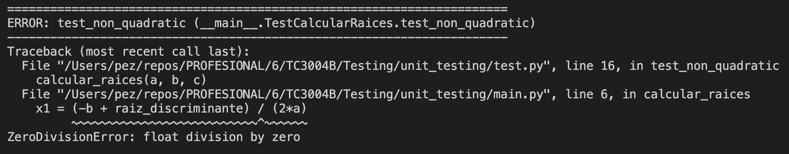
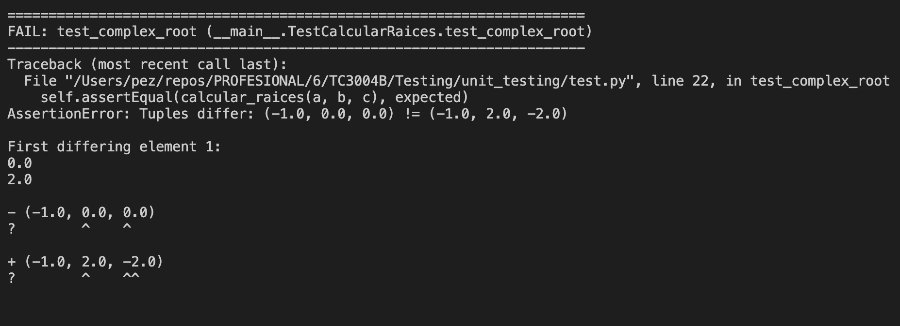
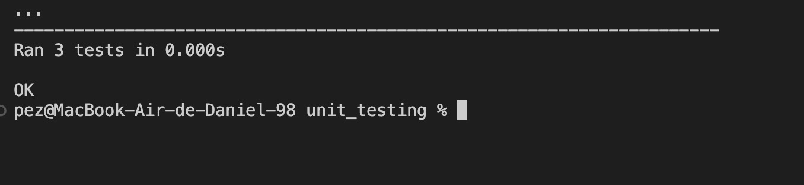

Fernando Daniel Monroy Sánchez

A01750536

# Unit Testing Exercise

## Unit Tests

```python
from main import calcular_raices
import unittest

class TestCalcularRaices(unittest.TestCase):

    # Two different real roots
    def test_two_roots(self):
        a, b, c = 1, -3, 2
        expected = (2.0, 1.0)
        self.assertEqual(calcular_raices(a, b, c), expected)

    # A = 0
    def test_non_quadratic(self):
        a, b, c = 0, 2, 1
        with self.assertRaises(ValueError):
            calcular_raices(a, b, c)

    # Imaginary root
    def test_complex_root(self):
        a, b, c = 1, 2, 5
        expected = (-1.0, 2.0, -2.0)
        self.assertEqual(calcular_raices(a, b, c), expected)

if __name__ == '__main__':
    unittest.main()
```

## Test 1

| Test              | Resultado                     |
| ----------------- | ----------------------------- |
| Raices diferentes | Pasó                          |
| a = 0             |  |
| Raíz imaginaria   |  |

## Código Nuevo

```python
import math
def calcular_raices(a, b, c):
    if a == 0:
        raise ValueError("El coeficiente 'a' no puede ser cero.")
    discriminante = b**2 - 4*a*c
    if discriminante >= 0:
        raiz_discriminante = math.sqrt(discriminante)
        x1 = (-b + raiz_discriminante) / (2*a)
        x2 = (-b - raiz_discriminante) / (2*a)
        return x1, x2
    else:
        parte_real = -b / (2*a)
        parte_imaginaria = math.sqrt(abs(discriminante)) / (2*a)
        return parte_real, parte_imaginaria, -parte_imaginaria

def main():
    print("Este programa resuelve ecuaciones cuadráticas de la forma ax^2 + bx + c = 0")
    a = float(input("Ingrese el coeficiente a: "))
    b = float(input("Ingrese el coeficiente b: "))
    c = float(input("Ingrese el coeficiente c: "))

    if a == 0:
        print("El coeficiente 'a' no puede ser cero. La ecuación no es cuadrática.")
        return

    try:
        raices = calcular_raices(a, b, c)
    except ValueError as e:
        print(e)
        return

    print("\nLas raíces de la ecuación son:")
    if raices is not None:
        for raiz in raices:
            print(raiz)
    else:
        print("No es una ecuación cuadrática.")

if __name__ == "__main__":
    main()
```

## Test 2

